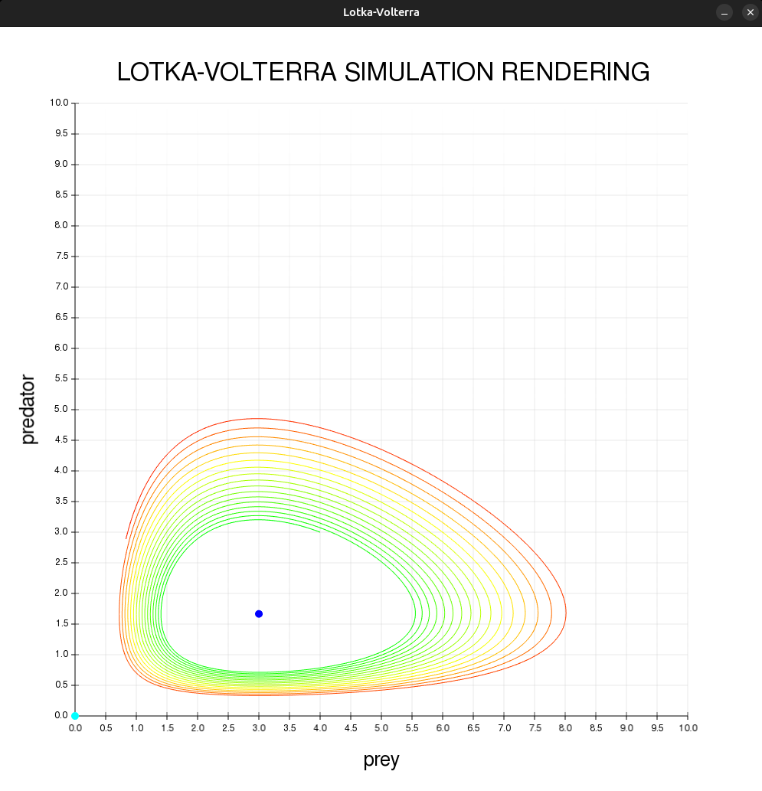

# Lotka–Volterra Prey–Predator Simulation

- [Introduction](#introduction)
- [Descriptions](#description)
- [Implementation](#implementation)
    - [Project Structure](#project-structure)
    - [Design choices](#design-choices)
        - [Simulation implementation](#simulation-implementation)
        - [Renderer implementation](#renderer-implementation)
        - [I/O implementation](#io-implementation)
        - [Main implementation](#main-implementation)
- [Input–Output](#inputoutput)
- [Compilation](#compilation)
- [Results](#results)
- [Testing](#testing)
    - [Simulation tests](#simulation-tests)
    - [Renderer tests](#renderer-tests)
    - [I/O tests](#io-tests)
- [Use of AI](#use-of-ai)
- [Author](#author)

---

## Introduction
This project is a C++ application developed for academic purposes.  
It implements a **Lotka–Volterra prey–predator simulation**, allowing the user to define initial conditions and model parameters and to study the system's evolution through a **discrete-time model**.  
It includes unit tests (with **Doctest**) and graphical rendering (with the **SFML** library).  

---

## Description
**Lotka–Volterra equations** are used to describe a simplified prey–predator
interaction in a given ecosystem:

$$
\begin{align*}
    \frac{dx}{dt} &= (A - B y(t)) x(t)\\
    \frac{dy}{dt} &= (C x(t) - D ) y(t)\\
\end{align*}
$$

$x(t)$ and $y(t)$ denote the prey and predator populations at time $t$, with $A$ and $C$ representing
their **intrinsic reproduction rates** under sufficient food
availability, and $B$ and $D$ representing their
respective **mortality rates**.    
    
The solution of the system of differential equations has two **equilibrium points**:

$$
\begin{align*}
    e_{1} &= (0, 0)\\
    e_{2} &= \left(\frac{D}{C}, \frac{A}{B} \right)\\
\end{align*}
$$

By discretizing the Lotka–Volterra equations, we obtain:

$$
\begin{align*}
x_i &= x_{i-1} + (A - B  y_{i-1}) x_{i-1} \Delta t\\
y_i &= y_{i-1} + (C x_{i-1} - D ) y_{i-1} \Delta t\\
\end{align*}
$$

Furthermore, by expressing the variables $(x_i, y_i)$ as fractions of the second
equilibrium point:

$$
\begin{align*}
x_i^{rel} &= x_{i} \frac{C}{D} \\
y_i^{rel} &= y_{i} \frac{B}{A} \\
\end{align*}
$$

the **discretized equations** become:

$$\begin{align*}
x_i^{rel} &= x_{i-1}^{rel} + A (1 - y_{i-1}^{rel}) x_{i-1}^{rel} \Delta t\\
y_i^{rel} &= y_{i-1}^{rel} + D (x_{i-1}^{rel} - 1) y_{i-1}^{rel} \Delta t\\
\end{align*}
$$

The system possesses a **first integral** that is conserved over time:

$$
\begin{align*}
H(x,y) &= -D\ln(x)+Cx+By-A\ln(y)
\end{align*}
$$

Henceforth, the first integral will be denoted as the **energy** of the system.

---

## Implementation
Hereinafter, the main project decisions are described and motivated.

### Project Structure
The project is organized in a hierarchical, tree-like directory structure.  
The root directory contains configuration and utility files, while the source code is divided into 4 dedicated subdirectories:

- **include/**: header files (class and function declarations)
    - _input.hpp_
    - _output.hpp_
    - _renderer.hpp_
    - _simulation.hpp_
- **io/**: input/output implementation files (handling user interaction and data writing)
    - _input.cpp_
    - _output.cpp_
- **src/**: main source files, including numerical simulation and rendering logic
    - _main.cpp_
    - _renderer.cpp_
    - _simulation.cpp_
- **test/**: unit test files (Doctest-based)
    - _renderer_test.cpp_
    - _simulation_test.cpp_
- _CMakeLists.txt_: build configuration file (for CMake and Ninja)
- _doctest.h_: testing framework header
- _font.ttf_: font resource file (used by renderer)
- _README.md_: this file

### Design Choices
The project is structured in a modular way, separating numerical simulation, graphical rendering and input/output handling into independent components.    
All the code related to the Lotka–Volterra model is contained in the `lotka_volterra` namespace, while input/output functionality is implemented within the `io` namespace.   

The project adopts a systematic validation of parameters and inputs at **run time**. Model parameters and numerical settings are verified prior to use in order to ensure physical consistency and numerical correctness.    

Error handling is implemented using 'throw' statements rather than `assert`, allowing configuration errors to be detected and reported at run time.    
This prevents the simulation and the renderer from operating on invalid or inconsistent states.

#### Simulation implementation
The simulation of the Lotka–Volterra system is implemented through a `Simulation` class.    
The state of the system at each time is represented by a `State` struct, containing the populations $x$, $y$ and the value of the first integral $H$.    
The `Simulation` class stores the time step `dt_`, the relative variables `x_rel_` and `y_rel_`, a vector of states `states_` and a vector of model parameters `pars_`.    
    
Private methods are used to check parameter validity, perform a single integration step and compute the energy. The public interface allows access to the simulation data and provides methods to evolve the system by one step, by a fixed number of steps or over a given time interval.

#### Renderer implementation
The `Renderer` class handles the graphical representation of the Lotka–Volterra simulation using SFML.    
It separates private members, which store internal state such as window size, axis scales, maximum world extents, trajectory points, last drawn step, text labels and others, from public methods that provide the drawing interface and configuration.    
    
Private methods compute tick steps, world scaling and manage incremental trajectory updates via `last_drawn_step_` and `sf::VertexArray`.    
This ensures that only newly evolved points are processed at each step to optimize performance.
    
The public interface includes the constructor, a getter for window size, a `setDraw` method to configure views and scaling based on current simulation state and two overloaded `draw` methods: one to render up to a specific step, useful for animated evolution, and one to draw the full trajectory at once.
    
Rendering uses two separate views: `ui_view` for fixed interface elements such as axes, labels, and titles and `world_view` for the dynamic simulation space, allowing independent scaling and translation without affecting the user interface.    
    
Trajectory points are colored according to deviations from the initial energy, providing a direct visual cue of the system's energetic changes, while equilibrium points are highlighted in distinct colors.    
    
Tick steps and axis scales are dynamically computed from the simulation's current maximum populations and a configurable margin, ensuring consistent and readable visualization across different system parameters and window sizes.

#### I/O implementation
Input and output operations are handled by a dedicated set of functions and are designed to be independent from the numerical core of the simulation, in order to improve modularity and maintainability.    
    
The simulation parameters and initial conditions can be provided in two different ways:
- **directly**, through the class constructors or specific setter functions, allowing programmatic configuration;
- **interactively**, through higher-level input functions that prompt the user via the terminal and validate the provided values.    
    
The output functionality provides a method to export the simulation data to a **CSV file**. At the end of the simulation, all recorded states (including time, prey and predator populations and the corresponding energy values) are written to disk in a structured, comma-separated format, allowing the results to be easily analyzed or post-processed using external tools.

#### Main implementation
The `main.cpp` file manages the execution of the simulation and the rendering of results.    
It first collects simulation parameters, initial conditions and rendering settings, either interactively from the user or programmatically from pre-defined values. A rendering window is created using SFML with customizable settings such as antialiasing (enabled to improve the visual smoothness of the trajectories and reduce jagged edges). 
    
The program then iterates over the simulation time steps: at each step, it evolves the system according to the discrete-time Lotka--Volterra model and draws the current state on the window. After the simulation completes, the trajectory data are exported to a CSV file.    
    
All operations are enclosed in a `try`/`catch` block to handle exceptions raised during parameter validation, evolution or rendering, ensuring that errors are reported clearly without abrupt termination.

---

## Input–Output
For interactive execution, the program requests the following parameters and initial conditions from the user via the terminal:
- time step $dt$, strictly positive and sufficiently small to ensure numerical stability ($0.0001 \leq dt \leq 0.01$);
- model parameters $A$, $B$, $C$ and $D$, all strictly positive;
- initial prey and predator population densities $x_0$ and $y_0$, which must be positive;
- total simulation time $T$, strictly positive and multiple of $dt$;
- window $size$, strictly positive and sufficiently large to ensure clear rendering ($800 \leq size \leq 1000$).    
    
All user inputs are validated at run time. If an invalid value is entered, an exception is raised and an explanatory message is displayed, preventing the simulation from starting with inconsistent or non-physical parameters.    

An example of valid interactive input is summarized below:
<div align="center">

| Parameter    | Value |
|:------------:|:-----:|
| $dt$         | 0.001 |
| $A$          | 10    |
| $B$          | 6     |
| $C$          | 4     |
| $D$          | 12    |
| $x_0$        | 4     |
| $y_0$        | 3     |
| $size$       | 1000  |
| $T$          | 10    |

</div>
<br>
If all user inputs are valid, the program provides two possible types of output, which are independent and optional:
- a window showing the evolution of the system in the $x - y$ plane, which can be displayed either step by step or as the complete trajectory;
- a CSV file containing the numerical data of the simulation, including populations and the value of the first integral at each time, exportable via a dedicated method.
    
These outputs allow the user to visualize and analyze the simulation results, but neither is required for the simulation to run.

---

## Compilation
> [!IMPORTANT]
> Make sure you have a C++20–compliant compiler.
> 
> If your compiler does not support C++20, please update it or use an alternative compiler that does.

The following dependencies are required:
- **SFML** (version 2.6 or later)
- **CMake** (version 3.28 or later)
- **Ninja**

To install them, please follow the commands below.    

On Linux:
```bash
$ sudo apt install libsfml-dev
$ sudo apt install cmake
$ sudo apt install ninja-build
```
On macOS:
```bash
% brew install sfml
% brew install cmake
% brew install ninja
```
Next, unzip `project.zip` (`project-main.zip` if downloaded directly from GitHub) and navigate to the project directory:
```bash
$ unzip project.zip
$ cd project
```
Then, create and configure the `build/` directory using the `CMakeLists.txt` file located in the current directory:
```bash
$ cmake -S . -B build -G"Ninja Multi-Config"
```
Finally, compile the program and run the tests in either **Debug** or **Release** mode:
```bash
$ cmake --build build --config Debug
$ cmake --build build --config Debug --target test
$ cmake --build build --config Release
$ cmake --build build --config Release --target test
```
The executable can then be run in either configuration:
```bash
$ ./build/Debug/project
$ ./build/Release/project
```

---

## Results
For valid input parameters (e.g. those reported in the table above), the program correctly produces both graphical and numerical outputs.    
    
The graphical output consists of the trajectory of the system in the $x - y$ phase plane, which can be displayed either incrementally (animated evolution) or as the complete trajectory. A clear and stable visualization is obtained when the initial conditions are chosen close to the non-trivial equilibrium point

$$
\begin{align*}
    e_{2} &= \left(\frac{D}{C}, \frac{A}{B} \right)
\end{align*}
$$

An example of the rendered trajectory (from the previous valid input) is shown below:

<div align="center">
  
</div>       
<br>
The numerical output can be exported to a CSV file containing the full simulation history, with one row per time step and columns for time, prey and predator populations and the value of the first integral.    
    
Degenerate initial conditions are handled consistently: if $x_0 = 0$ or $y_0 = 0$, the trajectory remains on the corresponding axis, while if $x_0 = y_0 = 0$ the system remains at the origin. In all cases, no populations emerge from zero.

---

## Testing
The project is validated through a comprehensive set of **unit tests** implemented using the **Doctest** framework. Testing focuses on the numerical correctness of the Lotka–Volterra simulation, the validation of input and parameters and the robustness of the rendering and I/O components.

### Simulation tests
The numerical core of the project is extensively tested to ensure physical consistency and numerical reliability. In particular, the tests verify:
- correct initialization of the simulation state and energy;
- proper handling of invalid parameters through exception throwing;
- correctness of time evolution using both fixed step counts and total simulation time;
- correct behavior in extinction scenarios, ensuring populations remain zero when appropriate;
- approximate conservation of the first integral (energy);
- convergence of the numerical solution under time step refinement;
- assessment of the first-order accuracy of the discretization.

### Renderer tests
The rendering subsystem is tested to ensure robustness and correct parameter validation.
Since graphical output is platform-dependent, tests focus on non-visual aspects and verify that:
- invalid window sizes are rejected;
- rendering functions execute without runtime errors for valid inputs;
- drawing functions correctly handle full and partial trajectories.

### I/O tests
Input and output functions are also tested to verify correct construction of simulation and renderer objects from validated input and successful export of simulation data to CSV format.

---

## Use of AI
Artificial intelligence tools were used as auxiliary support during the development of the project.    
    
AI assistance was employed to help resolve specific implementation issues in the graphical rendering subsystem (e.g. view handling and coordinate scaling) and to obtain minor guidance on `CMakeLists.txt` modifications aimed at avoiding compilation errors. AI was also used for support with technical English, as well as for occasional help with Markdown syntax used in this README file.    
    
All design choices and final implementations were independently validated by the author.

---

## Author
**Tommaso Federici**  
Alma Mater Studiorum – University of Bologna  
Bachelor's Degree in Physics (Second Year)  
Email: tommaso.federici3@studio.unibo.it
